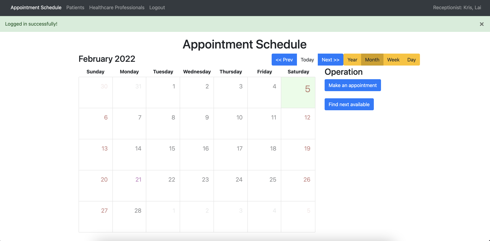
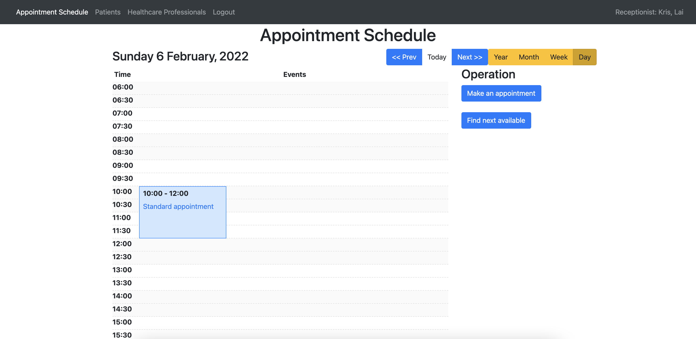

# Doctors' Surgery Information System (DSIS)
*A system designed for managing the appointment schedule for healthcare professionals*

## Screenshots



## Design
The DSIS has separated the front-end and the back-end applications. There are two main components in the system. We developed both applications with the Python programming language mainly.

The backend application is a RESTFul API server. It facilitates the data management of the DSIS with the MySQL database, and provides all needed information to the frontend application. It also control the access of all API endpoints to grant access to those authorized requests.

The frontend application is a web application. It provides an interface for accessing the data set from the MySQL repository. It communicates with the backend application when it received an instruction by employees, such as the receptionist making an appointment to the DSIS. The frontend application passes the form data to the backend application for further handling.

## The backend application duties
- The access control management
- Appointment schedule management
- Patient information management
- Prescription information management

## The frontend application duties
- Display, search, create, update, and delete appointments
- Collect the data from the user's request
- Communicate with the backend application

## Installation

The DSIS requires [Python](https://www.python.org/downloads/source/) v3.7+ to run.

Create a virtual environment

```sh
cd project_root_directory
python3 -m venv ./venv
```

Enter the virtual environment

```sh
source ./venv/bin/activate
```

Install all packages
```sh
pip3 install -r ./requirements.txt
```

## Development
### Environment Setup
Change the credential of the MySQL database
```sh
vi /project_root_directory/app/main/config.py
```
update the value of `${SQLALCHEMY_DATABASE_URI}` of the DevelopmentConfig class.

Initialize the oois_assignment database
```sh
cd /project_root_directory
mysql -u root -p
source ./init_db.sql;
exit;
python3 manage.py db init
python3 manage.py db migrate --message 'initial database migration'
python3 manage.py db upgrade
```

Start the backend application
```sh
cd /project_root_directory
python3 manage.py run_server
```

After the backend application starts successfully, we can access [the swagger documentation](http://127.0.0.1:5000/api) of all API endpoints.

Start the frontend application
```sh
cd /project_root_directory
python3 manage.py run_client
```

After the frontend application started successfully. We can access the interface of [the DSIS](http;//127.0.0.1:5050/login) portal.

The test account information
```
email: kris.lai@gmail.com
password: P@ssw0rd
```

## Unit test
### Testing Environment Setup
```sh
vi /project_root_directory/app/main/config.py
```
update the value of `${SQLALCHEMY_DATABASE_URI}` of the TestingConfig class.

Initialize the oois_assignment_test database
```sh
cd /project_root_directory
mysql -u root -p
source ./init_test_db.sql;
exit;
```

Run all unit tests
```sh
cd /project_root_directory
python3 manage.py test_server
```

## The strategy of organizing the project
The DSIS is a web application. Therefore, we followed the design pattern of the MVC model to separate classes by each layer of the MVC model.

The DSIS has two components, and we put it into app and client directories respectively. The backend application resides in the app directory. The frontend application resides in the client directory. 


The project structure of the DSIS
```
The DSIS
│   README.md   
│
└───app
│   │
│   └───main
│   │   │
│   │   └───controller
│   │   │
│   │   └───dto
│   │   │
│   │   └───model
│   │   │
│   │   └───service
│   │   │
│   │   └───util
│   │   │
│   │   └───...Other components
│   │
|   └───test
│
└───client
    │
    └───model
    │
    └───service
    │
    └───...Other components
    │
    └───views.py

```
